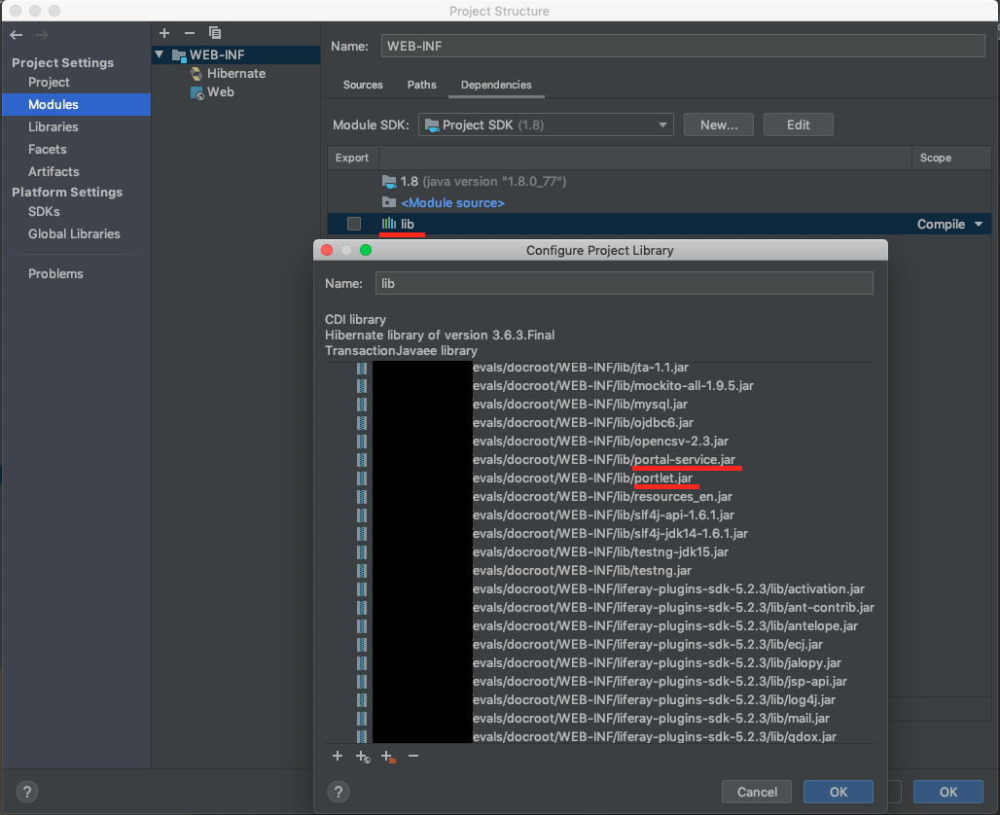

# EvalS
An electronically-driven performance evaluation system designed
to assist supervisors and employees to complete their annual
goal-setting and appraisal tasks.

[Wiki](https://wiki.library.oregonstate.edu/confluence/display/EVALS/EvalS+Home)

### Setup a local test environment
---
1. Using a docker container is recommended and can be found [here](https://github.sig.oregonstate.edu/ecs-data/ansible-private-roles/tree/master/roles/evals_liferay_server_setup). Otherwise instructions are as follows.

2. Java version 1.7.0_80 is the only version I was successful with

3. Choose and download a [Liferay version](https://sourceforge.net/projects/lportal/files/Liferay%20Portal/)
    - I had the most success with version 6.1.1-ce-ga2
    - Download liferay-portal-tomcat-${version}
    - Download liferay-plugins-sdk-${version}
    - Extract both folders to the same directory
    - Rename "liferay-portal-tomcat-${version}" to "bundles"
    - Add `CATALINA_HOME` to your path pointing to your tomcat directory
      - `export CATALINA_HOME="bundles/tomcat-${version}"`
    - Use `$CATALINA_HOME/bin/startup.sh` to start the server
    - Use `$CATALINA_HOME/bin/shutdown.sh` to stop the server

4. Test Liferay apache server
    - Open a browser to http://localhost:8080/web/guest/
    - Depending on the version of liferay you may not be asked to setup an admin account. In that case below is the default login information.
    - Default login information:
      - username: test@liferay.com
      - password: test

5. Setup test database or use existing oracle development server
    - I used [Mamp](https://www.mamp.info/en/) for a quick and dirty mysql server
    - Run evals/docroot/WEB-INF/src/edu/osu/cws/evals/tests/test-db.sql
    - Run evals/docroot/WEB-INF/src/edu/osu/cws/evals/tests/local-dev-env-data.sql

6. Configure EvalS
    - Clone this repository into `liferay-plugins-sdk-${version}/portlets/`
    - Navigate to `evals/docroot/WEB-INF/src/`
      - Copy `hibernate-sample.cfg.xml` to `hibernate.cfg.xml` and modify contents
      - Copy `evals.sample.properties` to `evals.properties` and modify contents
    - Add `evals-config.properties` to `/opt/lp5/`
    - Navigate to `evals/docroot/WEB-INF/`
      - Both `liferay-plugin-package.xml` and `liferay-plugin-package.properties` have a `liferay-versions` attribute. Set both these attributes to match the version of liferay you are using.

7. Install Ant version 1.9.6
    - Current version of Ant does not work with Java 1.7
    - Using brew:
        - `brew install ant@1.9`
        - add ant to path `brew link ant@1.9` (may have to force)

8. Compile EvalS
    - Navigate to `liferay-plugins-sdk-${version}`
    - Run `ant`
    - A war file will be created and placed in `bundles/deploy/`
    - A running tomcat server will automatically deploy this to `bundles/tomcat-${version}/webapps/`

9. Running EvalS
    - EvalS is a portlet and won't run on its own
    - Open a browser to http://localhost:8080/web/guest/ and login with the user you setup earlier or the default user
    - The UI can differ depending on the liferay version you are using but the steps should remain the same
    - Using the "Add" button in the top left corner add a new page
    - On that new page, use the "Add" button again and click "More..."
    - Search for EvalS, then click and drag it onto the page
    - If EvalS is not on the list or it shows an error message, check the logs in `bundles/tomcat-${version}/logs/catalina.out`

### Tests
---

1. In Intellij select File > New > Project from Existing Sources...

2. Make sure working directory is set correctly in Intellij
    - Should be the root directory of evals

3. In order for evals to compile in Intellij you need missing jars that are usually included with the liferay tomcat server.
    - Follow the instructions [here](#setup-a-local-test-environment) to get the `bundles` files.
    - Navigate to `bundles/tomcat-${version}/lib/ext/`
    - Copy `portlet.jar` and `portal-service.jar` to the evals repo
    - Sometimes you need `servlet-api.jar` which is one directory up in `bundles/tomcat-${version}/lib/`
    - Add the jars to the `lib` dependency in Intellij project settings
    

4. Follow the instructions in [Setup a local test environment](#setup-a-local-test-environment) to setup a mamp server
    - **NOTE THAT RUNNING TESTS WILL REMOVE ALL DATA FROM THE DATABASE AND REPLACE IT WITH TEST DATA**

5. In Intellij navigate to `evals/docroot/WEB-INF/src/edu/osu/cws/evals/`
    - Right click the `tests` folder and choose the option to run tests using Testng